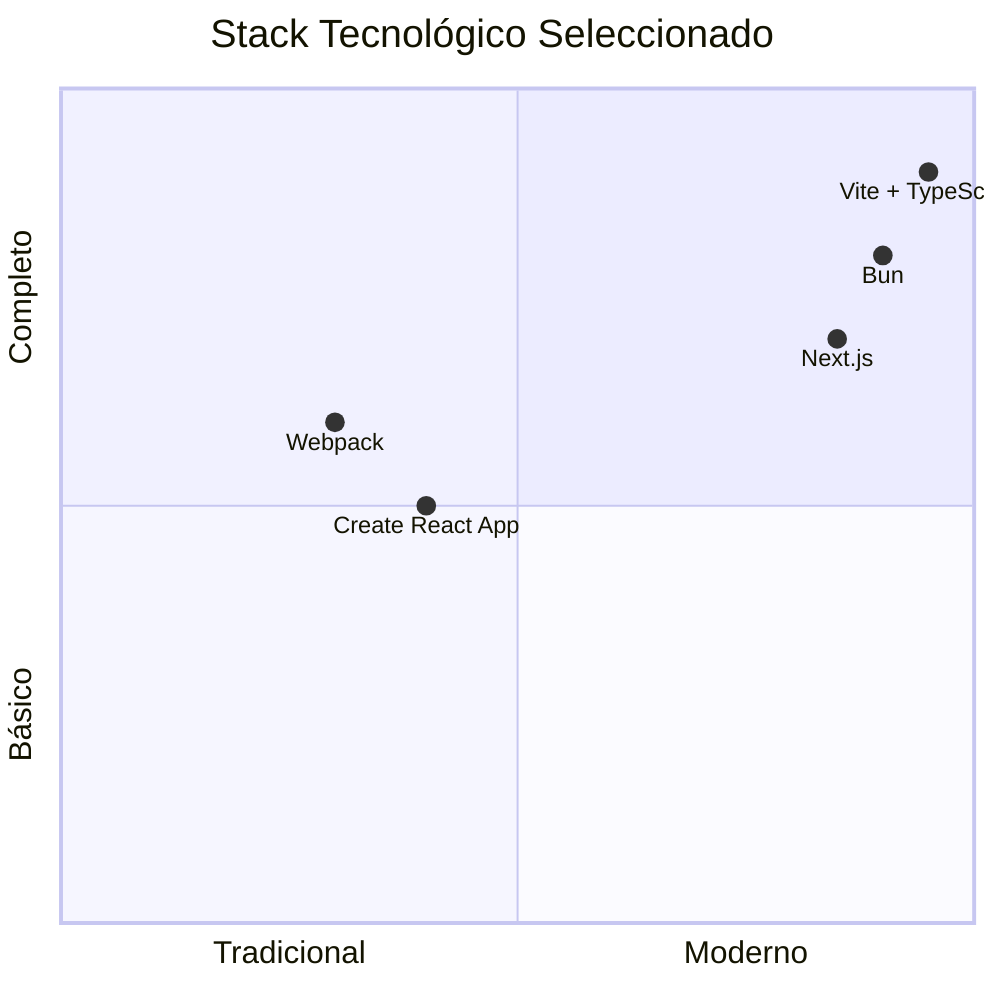
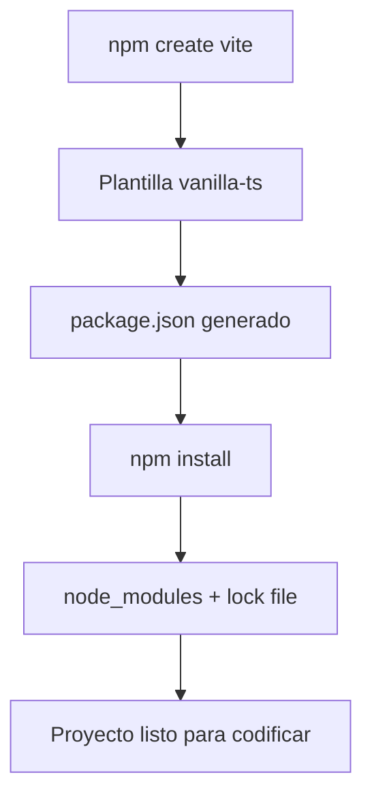
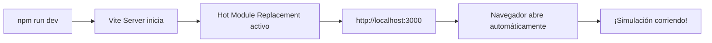
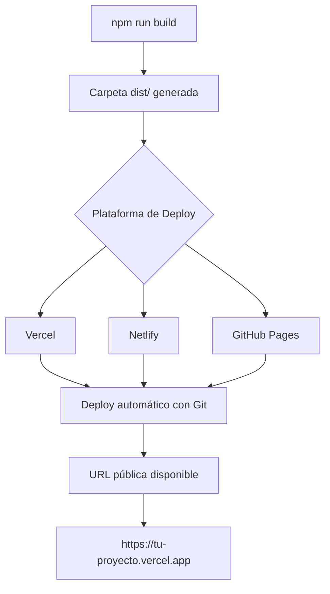

# Guía Completa: Migración a TypeScript 

Paso a paso usando el stack tecnológico tendencia 2026

## Stack Tecnológico Moderno



| Herramienta | Versión | Por qué es moderna |
|-------------|---------|-------------------|
| **Vite** | 5.x | Build tool más rápido (10-100x vs Webpack) |
| **TypeScript** | 5.x | Tipado estático con mejor DX |
| **Tailwind CSS** | 3.x | Utility-first CSS (tendencia dominante) |
| **pnpm** | 9.x | Package manager más rápido y eficiente |
| **ESLint + Prettier** | Latest | Calidad de código automatizada |

## PASO 1: Prerrequisitos

```bash
# Verificar instalaciones mínimas
node --version    # >= 18.0.0
npm --version     # >= 9.0.0 (o usar pnpm)
git --version     # Para control de versiones
```

> **Recomendación**: InstalaR [Node.js LTS](https://nodejs.org/) desde el sitio oficial.

## PASO 2: Inicializar Proyecto con Vite

```bash
# 1. Crear proyecto con plantilla TypeScript
npm create vite@latest constraints-simulation -- --template vanilla-ts

# 2. Entrar al directorio
cd constraints-simulation

# 3. Instalar dependencias base
npm install

# 4. Instalar dependencias de desarrollo (calidad de código)
npm install -D eslint prettier @types/node

# 5. Estructura inicial creada
```



## PASO 3: Estructura de Directorios Final

```bash
constraints-simulation/
├── public/
│   └── favicon.ico
├── src/
│   ├── types.ts          # Tipos TypeScript
│   ├── physics.ts        # Ecuaciones físicas
│   ├── integrator.ts     # RK4 solver
│   ├── renderer.ts       # Canvas rendering
│   ├── controls.ts       # UI bindings
│   ├── main.ts           # Entry point
│   ├── style.css         # Estilos (Tailwind opcional)
│   └── vite-env.d.ts     # Vite types
├── index.html            # HTML principal
├── package.json          # Dependencias y scripts
├── tsconfig.json         # Configuración TypeScript
├── vite.config.ts        # Configuración Vite
├── .gitignore            # Git ignore
└── README.md             # Documentación
```

```bash
# Crear estructura de carpetas
mkdir -p src
```

## PASO 4: Crear Archivos del Núcleo

### `src/types.ts`

```typescript
export type State = [number, number, number, number];

export interface Parameters {
  dt: number;
  g: number;
  k: number;
  L0: number;
  m1: number;
  m2: number;
}

export type Rate = [number, number, number, number];

export interface ViewConfig {
  xMin: number;
  xMax: number;
  yMin: number;
  yMax: number;
  scale: number;
}
```

### `src/physics.ts`

```typescript
import { State, Rate, Parameters } from './types';

export function y(x: number): number {
  return Math.pow(x, 4) - 2 * Math.pow(x, 2);
}

export function yp(x: number): number {
  return 4 * Math.pow(x, 3) - 4 * x;
}

export function ypp(x: number): number {
  return 12 * Math.pow(x, 2) - 4;
}

export function getRate(state: State, params: Parameters): Rate {
  const [x1, v1, x2, v2] = state;
  const { g, k, L0, m1, m2 } = params;

  const y1 = y(x1), y2 = y(x2);
  const yp1 = yp(x1), yp2 = yp(x2);
  const ypp1 = ypp(x1), ypp2 = ypp(x2);

  const Lx = x2 - x1;
  const Ly = y2 - y1;
  const L = Math.sqrt(Lx * Lx + Ly * Ly);

  const keff = k * (1 - L0 / L);

  const fx1 = keff * Lx;
  const fy1 = keff * Ly - g * m1;
  const fx2 = -keff * Lx;
  const fy2 = -keff * Ly - g * m2;

  const a11 = 1 / (m1 * (1 + yp1 * yp1));
  const a22 = 1 / (m2 * (1 + yp2 * yp2));

  const b1 = fx1 + yp1 * fy1;
  const b2 = fx2 + yp2 * fy2;

  const c1 = m1 * yp1 * ypp1 * v1 * v1;
  const c2 = m2 * yp2 * ypp2 * v2 * v2;

  const a1 = a11 * (b1 - c1);
  const a2 = a22 * (b2 - c2);

  return [v1, a1, v2, a2];
}

export function initialState(): State {
  return [-1.5, 0, -1.4, 0];
}

export function defaultParameters(): Parameters {
  return { dt: 0.01, g: 9.8, k: 1000, L0: 1.0, m1: 1, m2: 1 };
}
```

### `src/integrator.ts`

```typescript
import { State, Rate, Parameters } from './types';
import { getRate } from './physics';

export class RK4Integrator {
  private params: Parameters;

  constructor(params: Parameters) {
    this.params = params;
  }

  updateParameters(params: Parameters): void {
    this.params = params;
  }

  step(state: State): State {
    const { dt } = this.params;

    const k1 = getRate(state, this.params);
    const k2 = getRate(this.addState(state, this.scaleRate(k1, dt / 2)), this.params);
    const k3 = getRate(this.addState(state, this.scaleRate(k2, dt / 2)), this.params);
    const k4 = getRate(this.addState(state, this.scaleRate(k3, dt)), this.params);

    return [
      state[0] + (dt / 6) * (k1[0] + 2 * k2[0] + 2 * k3[0] + k4[0]),
      state[1] + (dt / 6) * (k1[1] + 2 * k2[1] + 2 * k3[1] + k4[1]),
      state[2] + (dt / 6) * (k1[2] + 2 * k2[2] + 2 * k3[2] + k4[2]),
      state[3] + (dt / 6) * (k1[3] + 2 * k2[3] + 2 * k3[3] + k4[3]),
    ];
  }

  private addState(s1: State, s2: Rate): State {
    return [s1[0] + s2[0], s1[1] + s2[1], s1[2] + s2[2], s1[3] + s2[3]];
  }

  private scaleRate(r: Rate, factor: number): Rate {
    return [r[0] * factor, r[1] * factor, r[2] * factor, r[3] * factor];
  }
}
```

### `src/renderer.ts`

```typescript
import { State, ViewConfig } from './types';
import { y } from './physics';

export class SimulationRenderer {
  private canvas: HTMLCanvasElement;
  private ctx: CanvasRenderingContext2D;
  private config: ViewConfig;

  constructor(canvasId: string, config: ViewConfig) {
    this.canvas = document.getElementById(canvasId) as HTMLCanvasElement;
    this.ctx = this.canvas.getContext('2d')!;
    this.config = config;
  }

  clear(): void {
    this.ctx.clearRect(0, 0, this.canvas.width, this.canvas.height);
  }

  drawSurface(): void {
    this.ctx.beginPath();
    this.ctx.strokeStyle = '#94a3b8';
    this.ctx.lineWidth = 2;

    const { xMin, xMax, scale } = this.config;
    const steps = 200;

    for (let i = 0; i <= steps; i++) {
      const x = xMin + (i / steps) * (xMax - xMin);
      const yVal = y(x);
      const px = this.toCanvasX(x);
      const py = this.toCanvasY(yVal);

      if (i === 0) this.ctx.moveTo(px, py);
      else this.ctx.lineTo(px, py);
    }
    this.ctx.stroke();
  }

  drawParticle(x: number, color: string, label: string): void {
    const px = this.toCanvasX(x);
    const py = this.toCanvasY(y(x));

    this.ctx.beginPath();
    this.ctx.arc(px, py, 8, 0, 2 * Math.PI);
    this.ctx.fillStyle = color;
    this.ctx.fill();

    this.ctx.fillStyle = '#1e293b';
    this.ctx.font = 'bold 12px Inter, sans-serif';
    this.ctx.fillText(label, px + 12, py - 12);
  }

  drawArrow(x: number, fx: number, fy: number, color: string): void {
    const px = this.toCanvasX(x);
    const py = this.toCanvasY(y(x));
    const scale = 0.05;

    const endX = px + fx * scale;
    const endY = py - fy * scale;

    this.ctx.beginPath();
    this.ctx.strokeStyle = color;
    this.ctx.lineWidth = 2;
    this.ctx.moveTo(px, py);
    this.ctx.lineTo(endX, endY);
    this.ctx.stroke();

    const angle = Math.atan2(endY - py, endX - px);
    this.ctx.beginPath();
    this.ctx.moveTo(endX, endY);
    this.ctx.lineTo(endX - 10 * Math.cos(angle - Math.PI / 6), endY - 10 * Math.sin(angle - Math.PI / 6));
    this.ctx.lineTo(endX - 10 * Math.cos(angle + Math.PI / 6), endY - 10 * Math.sin(angle + Math.PI / 6));
    this.ctx.closePath();
    this.ctx.fillStyle = color;
    this.ctx.fill();
  }

  private toCanvasX(x: number): number {
    return (x - this.config.xMin) * this.config.scale;
  }

  private toCanvasY(yVal: number): number {
    return (this.config.yMax - yVal) * this.config.scale;
  }
}
```

### `src/controls.ts`

```typescript
import { Parameters } from './types';

export class SimulationControls {
  private params: Parameters;
  private callbacks: { [key: string]: () => void } = {};

  constructor(params: Parameters) {
    this.params = params;
    this.bindInputs();
  }

  getParameters(): Parameters {
    return { ...this.params };
  }

  setParameters(params: Parameters): void {
    this.params = params;
    this.updateInputs();
  }

  onParameterChange(callback: () => void): void {
    this.callbacks['paramChange'] = callback;
  }

  private bindInputs(): void {
    ['dt', 'g', 'k', 'L0', 'm1', 'm2'].forEach((key) => {
      const input = document.getElementById(`param-${key}`) as HTMLInputElement;
      if (input) {
        input.value = this.params[key as keyof Parameters].toString();
        input.addEventListener('input', () => {
          this.params[key as keyof Parameters] = parseFloat(input.value);
          this.callbacks['paramChange']?.();
        });
      }
    });
  }

  private updateInputs(): void {
    ['dt', 'g', 'k', 'L0', 'm1', 'm2'].forEach((key) => {
      const input = document.getElementById(`param-${key}`) as HTMLInputElement;
      if (input) input.value = this.params[key as keyof Parameters].toString();
    });
  }
}
```

### `src/main.ts`

```typescript
import { State, Parameters, ViewConfig } from './types';
import { initialState, defaultParameters } from './physics';
import { RK4Integrator } from './integrator';
import { SimulationRenderer } from './renderer';
import { SimulationControls } from './controls';
import './style.css';

class SimulationApp {
  private state: State;
  private params: Parameters;
  private integrator: RK4Integrator;
  private renderer: SimulationRenderer;
  private controls: SimulationControls;
  private running: boolean = false;
  private animationId: number | null = null;

  constructor() {
    this.params = defaultParameters();
    this.state = initialState();
    this.integrator = new RK4Integrator(this.params);
    this.renderer = new SimulationRenderer('sim-canvas', {
      xMin: -1.6, xMax: 1.6, yMin: -1.6, yMax: 1.6, scale: 200,
    });
    this.controls = new SimulationControls(this.params);
    this.setupButtons();
    this.controls.onParameterChange(() => this.onParameterUpdate());
  }

  private onParameterUpdate(): void {
    this.params = this.controls.getParameters();
    this.integrator.updateParameters(this.params);
  }

  private setupButtons(): void {
    document.getElementById('btn-start')?.addEventListener('click', () => this.toggleRunning());
    document.getElementById('btn-reset')?.addEventListener('click', () => this.reset());
  }

  private toggleRunning(): void {
    this.running = !this.running;
    const btn = document.getElementById('btn-start') as HTMLButtonElement;
    btn.textContent = this.running ? 'Pause' : 'Start';
    if (this.running) this.loop();
    else if (this.animationId) cancelAnimationFrame(this.animationId);
  }

  private reset(): void {
    this.running = false;
    this.state = initialState();
    this.params = defaultParameters();
    this.controls.setParameters(this.params);
    this.integrator.updateParameters(this.params);
    this.render();
    const btn = document.getElementById('btn-start') as HTMLButtonElement;
    btn.textContent = 'Start';
  }

  private loop(): void {
    if (!this.running) return;
    this.state = this.integrator.step(this.state);
    this.render();
    this.animationId = requestAnimationFrame(() => this.loop());
  }

  private render(): void {
    this.renderer.clear();
    this.renderer.drawSurface();
    const [x1, , x2, ] = this.state;
    this.renderer.drawParticle(x1, '#3b82f6', 'm1');
    this.renderer.drawParticle(x2, '#ef4444', 'm2');
  }

  start(): void {
    this.render();
  }
}

document.addEventListener('DOMContentLoaded', () => {
  new SimulationApp().start();
});
```

### `src/style.css`

```css
@import url('https://fonts.googleapis.com/css2?family=Inter:wght@400;600;700&display=swap');

* { box-sizing: border-box; margin: 0; padding: 0; }

body {
  font-family: 'Inter', sans-serif;
  background: linear-gradient(135deg, #f1f5f9 0%, #e2e8f0 100%);
  min-height: 100vh;
  padding: 2rem;
  color: #1e293b;
}

.container { max-width: 1200px; margin: 0 auto; }

h1 {
  text-align: center;
  margin-bottom: 2rem;
  color: #0f172a;
  font-weight: 700;
}

.main-content {
  display: flex;
  gap: 2rem;
  flex-wrap: wrap;
  justify-content: center;
}

#sim-canvas {
  border: 2px solid #cbd5e1;
  border-radius: 12px;
  background: white;
  box-shadow: 0 4px 6px -1px rgba(0, 0, 0, 0.1);
}

.controls-panel {
  flex: 1;
  min-width: 280px;
  max-width: 350px;
  background: white;
  padding: 1.5rem;
  border-radius: 12px;
  box-shadow: 0 4px 6px -1px rgba(0, 0, 0, 0.1);
}

.controls-panel h3 { margin-bottom: 1rem; color: #0f172a; font-weight: 600; }

.controls-panel label {
  display: flex;
  justify-content: space-between;
  align-items: center;
  margin-bottom: 0.75rem;
  font-size: 0.875rem;
}

.controls-panel input {
  width: 100px;
  padding: 0.5rem;
  border: 1px solid #cbd5e1;
  border-radius: 6px;
  text-align: right;
}

.buttons { display: flex; gap: 0.75rem; margin-top: 1.5rem; }

.buttons button {
  flex: 1;
  padding: 0.75rem;
  border: none;
  border-radius: 6px;
  cursor: pointer;
  font-weight: 600;
  transition: all 0.2s;
}

#btn-start { background: #10b981; color: white; }
#btn-reset { background: #ef4444; color: white; }
.buttons button:hover { transform: translateY(-1px); opacity: 0.9; }
```

### `index.html`

```html
<!DOCTYPE html>
<html lang="es">
<head>
  <meta charset="UTF-8" />
  <meta name="viewport" content="width=device-width, initial-scale=1.0" />
  <title> Simulación de Partículas con Restricción</title>
  <link rel="icon" type="image/svg+xml" href="/vite.svg" />
</head>
<body>
  <div class="container">
    <h1> Dos Partículas con Restricción</h1>
    <div class="main-content">
      <canvas id="sim-canvas" width="640" height="640"></canvas>
      <div class="controls-panel">
        <h3> Parámetros</h3>
        <label>dt: <input type="number" id="param-dt" step="0.001"></label>
        <label>g: <input type="number" id="param-g" step="0.1"></label>
        <label>k: <input type="number" id="param-k" step="10"></label>
        <label>L0: <input type="number" id="param-L0" step="0.1"></label>
        <label>m1: <input type="number" id="param-m1" step="0.1"></label>
        <label>m2: <input type="number" id="param-m2" step="0.1"></label>
        <div class="buttons">
          <button id="btn-start">Start</button>
          <button id="btn-reset">Reset</button>
        </div>
      </div>
    </div>
  </div>
  <script type="module" src="/src/main.ts"></script>
</body>
</html>
```

## PASO 5: Configuración de Vite

### `vite.config.ts`

```typescript
import { defineConfig } from 'vite';

export default defineConfig({
  server: {
    port: 3000,
    open: true,
  },
  build: {
    outDir: 'dist',
    sourcemap: true,
  },
});
```

### `tsconfig.json` (actualizar)

```json
{
  "compilerOptions": {
    "target": "ES2020",
    "useDefineForClassFields": true,
    "module": "ESNext",
    "lib": ["ES2020", "DOM", "DOM.Iterable"],
    "skipLibCheck": true,
    "moduleResolution": "bundler",
    "allowImportingTsExtensions": true,
    "resolveJsonModule": true,
    "isolatedModules": true,
    "noEmit": true,
    "strict": true,
    "noUnusedLocals": true,
    "noUnusedParameters": true,
    "noFallthroughCasesInSwitch": true
  },
  "include": ["src"]
}
```

## PASO 6: Ejecutar el Proyecto



```bash
# 1. Modo desarrollo (con HMR - recarga caliente)
npm run dev

# 2. Acceder en el navegador
# http://localhost:3000

# 3. Modo producción (build optimizado)
npm run build

# 4. Previsualizar build de producción
npm run preview
```

## PASO 7: Calidad de Código (Opcional pero Recomendado)

### `.prettierrc`

```json
{
  "semi": true,
  "singleQuote": true,
  "tabWidth": 2,
  "printWidth": 100,
  "trailingComma": "es5"
}
```

### `.eslintrc.cjs`

```javascript
module.exports = {
  root: true,
  env: { browser: true, es2020: true },
  extends: ['eslint:recommended', 'plugin:@typescript-eslint/recommended'],
  parser: '@typescript-eslint/parser',
  plugins: ['@typescript-eslint'],
};
```

```bash
# Instalar herramientas de calidad
npm install -D @typescript-eslint/parser @typescript-eslint/eslint-plugin eslint-plugin-prettier

# Ejecutar linter
npm run lint

# Formatear código
npx prettier --write "src/**/*.{ts,js}"
```

## PASO 8: Deploy a Producción



### Opción A: Vercel (Recomendado)

```bash
# Instalar Vercel CLI
npm install -g vercel

# Deploy
vercel

# Seguir prompts, ¡listo!
```

### Opción B: Netlify Drop

```bash
# 1. Build
npm run build

# 2. Arrastrar carpeta 'dist' a https://app.netlify.com/drop
```

### Opción C: GitHub Pages

```bash
# En package.json agregar:
"scripts": {
  "deploy": "gh-pages -d dist"
}

# Instalar y deploy
npm install -D gh-pages
npm run deploy
```

---

## Resumen de Comandos Clave

```bash
# ═══════════════════════════════════════════════════════════
# COMANDO                    # DESCRIPCIÓN
# ═══════════════════════════════════════════════════════════
# npm create vite@latest     # Crear proyecto nuevo
# npm install                # Instalar dependencias
# npm run dev                # Servidor desarrollo (HMR)
# npm run build              # Build producción
# npm run preview            # Previsualizar build
# npm run lint               # Ejecutar linter
# vercel                     # Deploy a Vercel
# ═══════════════════════════════════════════════════════════
```

---

## Checklist Final de Validación

```markdown
## [ ] Proyecto inicializado con Vite
## [ ] Todos los archivos TypeScript creados
## [ ] npm run dev ejecuta sin errores
## [ ] Canvas muestra la superficie y(x)
## [ ] Partículas se mueven sobre la curva
## [ ] Sliders actualizan parámetros en tiempo real
## [ ] Start/Pause/Reset funcionan
## [ ] Build de producción genera carpeta dist/
## [ ] Deploy a Vercel/Netlify exitoso
```

---

> Simulación física completa con **tecnologías 2026**: Vite (build ultrarrápido), TypeScript (tipado seguro), Canvas API (renderizado nativo) y deploy gratuito. El código es modular, mantenible y listo para producción.
